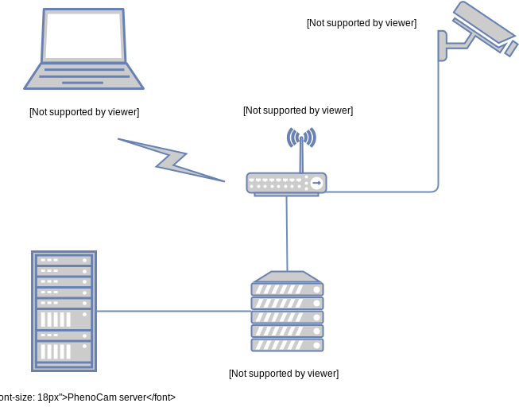

# PhenoCam Installation Tool (PIT) v2

PhenoCam Installation Tool (PIT) is a set of scripts to configure Stardot Netcam Live 2 for the use as a phenocam associated with the [PhenoCam network](http://phenocam.nau.edu). Version 2 addresses the installation routine for the Stardot Netcam Live 2 cameras which supercede the previous default Netcam SC5 cameras within the PhenoCam or affiliated networks.

## Installation

This software is provided under a perpetual license to the PhenoCam US network and its users in it's basic form. All other users require a **license** and/or service contract from the copyright holder, BlueGreen labs (BV) for the use of this software. Unlicensed use of the software or its reverse engineering is considered a violation of copyright and will be prosecuted under the US DMCA or EU Directive on Copyright in the Digital Single Market (2019/790) or other applicable law.

### WARNING / DISCLAIMER

The default password on the Stardot cameras is INSECURE. Connecting any camera to an open network, without a firewall, will result in your camera being hacked (with estimated times to infection < 30 min). ALWAYS configure the camera password to a non-default secure password over a secure network. BlueGreen Labs (BV) is not liable for the abuse of misconfigured cameras as a vector for network breaches and cyber-attacks due to lack of due diligence on part of the user.

### Hardware prerequisites

Please connect a computer and the PhenoCam to the same (wireless) router which has internet access. Once your camera is powered on and connected to the network you will need to find your camera’s network IP address. Make sure that the computer you are using was able to connect to the network and got an IP via DHCP.



The easiest way to find the camera’s IP address is to install [StarDot Tools](http://www.stardot.com/downloads). Run the StarDot Tools program and click “refresh”. The camera should be detected and the camera’s IP address shown (you may have to run Tools as administrator in Windows, depending on your settings).

If you are configuring your camera with a non-Windows computer there are other things you can do to find the IP address of the camera. From a Linux or Mac OS X terminal window you should be able to type the following commands (assuming `192.168.1.255` is the network broadcast address reported by `ifconfig`):

```bash
ping -c 3 -b 192.168.1.255
arp -a
```

to get a list of the MAC addresses and IP’s of all the computers on the local network. The StarDot cameras have a MAC address that starts with 00:30 so you may be able to find the camera that way. Again, you may need help from the local network administrator for this step.

### Software prerequisites

For the script to run successfully you will need an `ssh` client and bash support, these are included in both MacOS and Linux default installs and can be provided in Windows by [using the linux subsystem](https://learn.microsoft.com/en-us/windows/wsl/install). 

You can download this required repository by either a direct download of a [zip file](https://github.com/bluegreen-labs/phenocam_installation_tool_v2/), or if you have git running by cloning the branch with:

```bash
git clone -b netcamlive https://github.com/bluegreen-labs/phenocam_installation_tool_v2.git
```

In the (unzipped) project directory you can then execute the below commands. The installation tool uses the following syntax

```bash
./PIT.sh -i 192.168.1.xxx -n testcam -o 1 -t GMT -s 9 -e 22 -m 13

```

with:

| Parameter     | Description |
| ------------- | ------------------------------ |
| -i            | ip address of the camera |
| -n            | the name of the camera / site |
| -o            | difference in hours from UTC of the timezone in which the camera resides (always use + or - signs to denote differences from UTC) |
| -t            | a text string corresponding to the local time zone (e.g. EST) |
| -s            | first hour of the scheduled image acquisitions (e.g. 4 in the morning) |
| -e            | last hour of the scheduled image acquisitions (e.g. ten at night, so 22 in 24-h notation) |
| -m            | interval minutes, at which to take pictures (e.g. 15, every 15 minutes - default phenocam setting is 30) |
| -d (optional) | image destination server (ip address / domain), defaults to phenocam.nau.edu|

## License

```
Copyright (c) 2023-present BlueGreen Labs

Permission is hereby granted, free of charge, to limited persons obtaining a copy
of this software and associated documentation files (the "Software"), to deal
in the Software subject to the following conditions:

THE SOFTWARE COVERS USE WITHIN THE PHENOCAM (US) NETWORK, WITH SELECT SITES 
AFFILIATED WITH THE NETWORK PROVIDED WITH A LICENSE TO USE THIS CONFIGURATION TOOL.
ALL OTHER USE CASES ARE REQUIRE ON A LICENSE AGREEMENT FROM THE COPYRIGHT HOLDERS.

IN NO EVENT SHALL THE AUTHORS OR COPYRIGHT HOLDERS BE LIABLE FOR ANY CLAIM, 
DAMAGES OR OTHER LIABILITY, WHETHER IN AN ACTION OF CONTRACT, TORT OR OTHERWISE,
ARISING FROM, OUT OF OR IN CONNECTION WITH THE SOFTWARE OR THE USE OR OTHER 
DEALINGS IN THE SOFTWARE.
```

